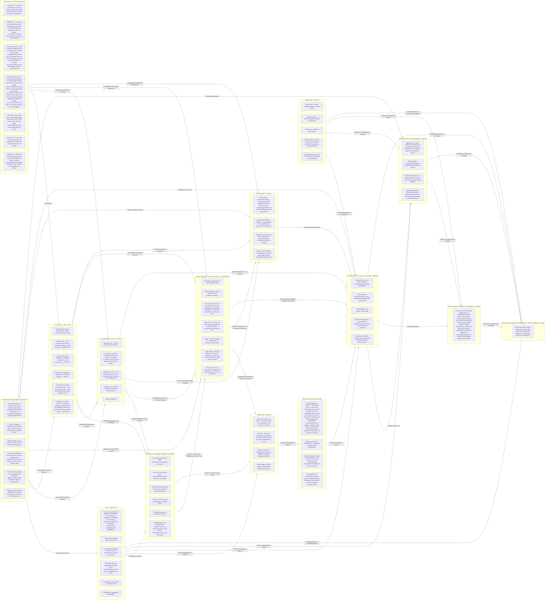

```mermaid
graph LR
    subgraph A[Old Testament - 10th-4th century BC]
        direction LR
        A1[Genesis 1:27 - 'So God created man in His own image, in the image of God He created him, male and female He created them.']
        A2[Isaiah 56:3-7 - 'Let not the foreigner who has joined himself to the LORD say, 'The LORD will surely separate me from His people.' <br/>... For My house will be called a house of prayer for all the peoples.']
        A3[Leviticus 19:33-34 - 'When a stranger resides with you in your land, you shall not do him wrong. <br/>The stranger who resides with you shall be to you as the native among you, and you shall love him as yourself, <br/>for you were aliens in the land of Egypt, I am the LORD your God.']
        A4[Deuteronomy 10:17-19 - 'For the LORD your God is the God of gods and the Lord of lords, the great, the mighty, <br/>and the awesome God who does not show partiality nor take a bribe. <br/>He executes justice for the orphan and the widow, and shows His love for the alien by giving him food and clothing. <br/>So show your love for the alien, for you were aliens in the land of Egypt.']
        A5[Micah 6:8 - 'He has told you, O man, what is good, And what does the LORD require of you but to do justice, <br/>to love kindness, and to walk humbly with your God?']
        A6[Exodus 22:21 - 'You shall not wrong a stranger or oppress him, for you were strangers in the land of Egypt.']
        A7[Malachi 2:10 - 'Do we not all have one father? Has not one God created us? <br/>Why do we deal treacherously each against his brother so as to profane the covenant of our fathers?']
    end

    subgraph B[Nicomachean Ethics, Aristotle - 384-322 BC]
        direction LR
        B1['The good for man is an activity of the soul in conformity with virtue, <br/>or if there are more kinds of virtue than one, <br/>in conformity with the best and most perfect kind.']
        B2['Virtue is a state of character concerned with choice, lying in a mean, <br/>determined by a rational principle.']
        B3['Without friends, no one would want to live, even if he had all other goods.']
        B4['We are not studying to know what virtue is, but to become good. <br/>Intellectual virtue owes its birth to teaching, moral virtue to habit.']
        B5['The life of money-making is one undertaken by compulsion. <br/>Wealth is merely useful and for the sake of something else.']
        B6['Happiness is the meaning and the purpose of life, <br/>the whole aim, and end of human existence.']
    end

    subgraph C[Cicero - 106-43 BC]
        direction LR
        C1['True law is right reason in agreement with nature, <br/>it is of universal application, unchanging and everlasting, <br/>it summons to duty by its commands, <br/>and averts from wrongdoing by its prohibitions.']
        C2['Justice is the crowning glory of the virtues.']
        C3['The first duty is to keep one's mind serene. <br/>the second is to stick to one's duties.']
        C4['Friendship improves happiness and abates misery, <br/>by the doubling of our joy and the dividing of our grief.']
        C5['The welfare of the people is the highest law.']
        C6['Eloquence is a painting of the thoughts.']
    end

    subgraph JC[Jesus Christ - 4 BC - AD 30]
        direction LR
        JC1[Sermon on the Mount - Emphasizing humility, mercy, and purity of heart.]
        JC2[Golden Rule - 'So in everything, do to others what you would have them do to you.' - Matthew 7:12]
        JC3[Parable of the Good Samaritan - Illustrating universal love and compassion. - Luke 10:25-37]
        JC4[Teaching on Forgiveness - 'Forgive, and you will be forgiven.' - Luke 6:37]
        JC5[Teaching on Love and Commandments - 'Love the Lord your God... Love your neighbor as yourself.' - Matthew 22:37-40]
        JC6[Teaching on Serving Others - 'The greatest among you should be like the youngest, and the one who rules like the one who serves.' - Luke 22:26]
    end

    subgraph D[Various Epistles, St. Paul - 50-60 AD]
        direction LR
        D1[Galatians 3:28 - 'There is neither Jew nor Greek...']
        D2[1 Corinthians 12:12-27 - 'so that there may be no division in the body, <br/>but that the parts may have the same care for one another.']
        D3[Ephesians 2:14-18 - 'who made both groups into one and broke down the barrier of the dividing wall']
        D4[Colossians 3:11 - 'there is no distinction between Greek and Jew']
        D5[Letter to Philemon]
    end

    subgraph E[City of God, St. Augustine of Hippo - 413-426 AD]
        direction LR
        E1['The earthly city glories in itself, <br/>the Heavenly City glories in the Lord.']
        E2['Free will, without God's grace, <br/>is not sufficient to lead to the action of salvation.']
        E3['The grace of God does not find men fit for salvation, but makes them so.']
        E4['The Church is the earthly city that fights for eternal peace.']
        E5['Time itself follows, not precedes, creation.']
        E6['Understanding is the reward of faith. <br/>Therefore seek not to understand that you may believe, <br/>but believe that you may understand.']
    end

    subgraph G[Magna Carta - 1215 AD]
        direction LR
        G1['Rule of Law - No one, including the king, is above the law']
        G2['Habeas Corpus - Protection against unlawful imprisonment']
        G3['Trial by Jury - Right to a trial by peers']
        G4['Consent of the Governed - The king must seek the consent of his barons for certain decisions']
        G5['Limited Monarchical Power - Restrictions on the power of the monarchy']
    end

    subgraph F[Summa Theologica, St. Thomas Aquinas - 1225-1274 AD]
        direction LR
        F1[Five Ways - Arguments for the existence of God.]
        F2[God's Simplicity - 'God is simple, without composition of parts.']
        F3[Free Will - 'Man has free will- otherwise counsels, exhortations, commands, prohibitions, rewards, and punishments would be in vain.']
        F4[Natural Law - 'The natural law is nothing else than the rational creature's participation in the eternal law.']
        F5[Grace - 'Grace is required to cure the soul, to preserve it, and to lead it.']
        F6[Christ's Role - 'The only begotten Son of God... assumed our nature, so that he, made man, might make men gods.']
        F7[Resurrection - 'In the resurrection, nothing will be accidental, but only what is substantial.']
    end

    subgraph H[Hugo Grotius - 1625 AD]
        direction LR
        H1[On the Law of War and Peace - 'The law of nature is unchangeable- even God cannot change it.']
        H2[Free Sea - 'The sea is common to all, because it is so limitless that it cannot become a possession of any one.']
        H3[Religious Tolerance - Advocacy for freedom of religion and against religious persecution.]
        H4[Natural Rights - 'Rights which are derived from natural law or reason.']
    end

    subgraph J[Richard Hooker - 1594 AD]
        direction LR
        J1[Of the Laws of Ecclesiastical Polity - 'Change not ancient landmarks which thy fathers have set.' <br/>- Emphasizing tradition and reason in the governance of the Church.]
        J2[Reason and Tradition - 'Reason is a special gift of God, and the light of reason is the light of God.']
        J3[Separation of Church and State - Arguing for a distinction between ecclesiastical and civil authority.]
        J4[Natural Law - Upholding the importance of natural law in both civil and ecclesiastical governance.]
    end

    subgraph I[Samuel von Pufendorf - 1672 AD]
        direction LR
        I1[De Jure Naturae et Gentium - 'The state of nature... has a law of nature to govern it, which obliges every one: <br/>and reason, which is that law, teaches all mankind, who will but consult it, that being all equal and independent, <br/>no one ought to harm another in his life, health, liberty, or possessions.' <br/>- Emphasizing social contract, natural rights, and the role of the state.]
        I2[Separation of Powers - Advocated for a separation of powers within government.]
        I3[Moral Philosophy - 'Man is sociable by nature, and antisocial by habit.' <br/>- Emphasizing the importance of social bonds and moral duties.]
        I4[International Law - Considered a founding figure of international law, focusing on natural law as a basis for relations between states.]
    end


    subgraph L[Two Treatises of Government, John Locke - 1689 AD]
        direction LR
        L1['State of Nature - A pre-political condition characterized by freedom and equality']
        L2['Social Contract - Individuals agree to form a government to protect their natural rights']
        L3['Natural Rights - Life, Liberty, and Property']
        L4['Government Legitimacy - Governments are legitimate only if they have the consent of the governed']
        L5['Separation of Powers - Division of government into distinct branches to prevent tyranny']
    end

    subgraph M[The Spirit of the Laws, Montesquieu - 1748 AD]
        direction LR
        M1['Separation of Powers - Division of political power into separate branches to prevent any one entity from gaining a monopoly on power']
        M2['Political Liberty - Protection of individual freedoms and prevention of tyranny']
        M3['Climate and Culture - The effect of climate on human behavior and governmental systems']
        M4['Checks and Balances - Different branches of government have powers that enable them to check the other branches']
    end

    subgraph N[Virginia Declaration of Rights, George Mason - 1776 AD]
        direction LR
        N1['That all men are by nature equally free and independent, and have certain inherent rights,<br/> of which, when they enter into a state of society, they cannot, by any compact, deprive or divest <br/>their posterity- namely, the enjoyment of life and liberty, with the means of acquiring and <br/>possessing property, and pursuing and obtaining happiness and safety.']
    end

    subgraph O[United States Declaration of Independence, Thomas Jefferson - 1776 AD]
        direction LR
        O1[All men are created equal, endowed by their Creator with certain unalienable Rights - Life, Liberty and the pursuit of Happiness.]
    end

    classDef foundational fill:#B71C1C;
    classDef major fill:#E64A19;
    classDef intermediary fill:#FBC02D;
    classDef source fill:#388E3C;
    classDef final fill:#1976D2;

    class A,B,G foundational;
    class JC,D,C major;
    class E,F intermediary;
    class H,I,L,M,J source;
    class N,O final;


    A -->|Foundational| JC
    A -->|Scriptural Foundation for Doctrines| D
    A -->|Foundational Theological Reference| F
    A -->|Theological Foundation for Anglicanism| J

    B -->|Philosophical Influence| C
    B -->|Contextual or Cultural Influence| JC
    B -->|Contextual or Cultural Influence| D
    B -->|Integration into Scholastic Thought| F
    B -->|Indirect Thematic Influence| J
    B -->|Philosophical Influence| L
    B -->|Philosophical Influence| M

    C -->|Philosophical Influence| E
    C -->|Indirect Philosophical Influence| H
    C -->|Indirect Philosophical Influence| L
    C -->|Ideas on Separation of Powers| M
    C -->|Indirect Influence on Republican Ideas| O

    JC -->|Theological Influence and Apostle| D
    JC -->|Theological Inspiration and Framework| E
    JC -->|Foundational Theological Influence| F
    JC -->|Indirect Theological Influence| J

    D -->|Influence through Christian Doctrine| E
    D -->|Theological Influence via Christian Thought| F
    D -->|Influence through Christian Theology| J
    D -->|Influence via Natural Law Tradition| L

    E -->|Influence on Christian Philosophy and Natural Law| F
    E -->|Influence on Natural Law Theory| H

    F -->|Philosophical Influence on Natural Law Theory| H
    F -->|Indirect Theological and Philosophical Influence| J
    F -->|Indirect Influence through Natural Law Theory| L

    G -->|Legal Precedent and Foundation| L
    G -->|Influence on Enlightenment Thought| M
    G -->|Historical Precedent for Rights| N
    G -->|Indirect Influence on Democratic Principles| O

    H -->|Legal and Philosophical Influence| I

    I -->|Indirect Philosophical Influence| L

    J -->|Possible Thematic Influence| L

    L -->|Ideological Influence| M
    L -->|Ideological Influence| N
    L -->|Ideological Influence on Principles| O

    M -->|Influence on Democratic Structure| N
    M -->|Influence on Democratic Principles| O

    N -->|Influence on Content and Principles| O


```
